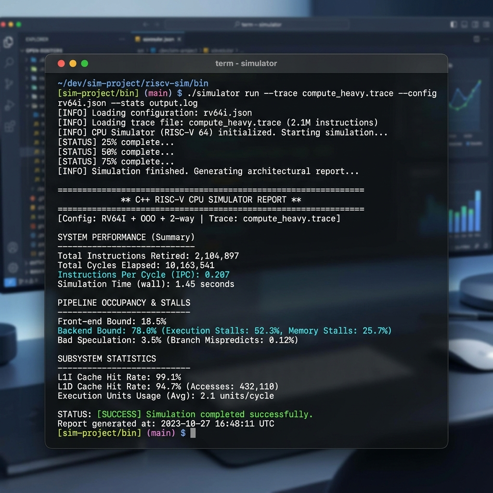
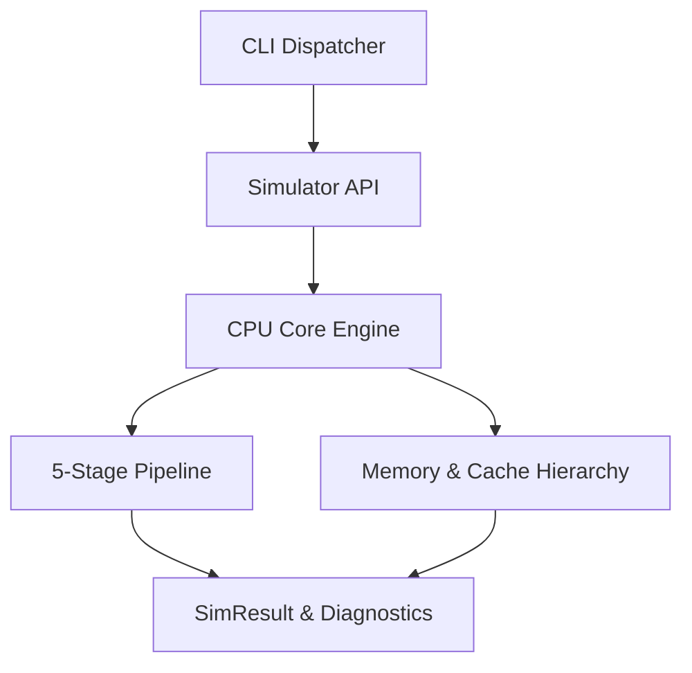

# Performance Analysis-Oriented CPU Simulator 🚀

🚀 A CLI-based performance analysis engine for diagnosing pipeline bottlenecks in modern CPU architectures.



**✔ Deterministic simulator with full stall attribution** | **✔ 18/18 high-signal architectural tests passed**

**A cycle-driven architectural simulator designed specifically for performance engineers to reason about bottlenecks, not just measure performance.**

> **"This simulator is designed not to maximize IPC, but to explain why IPC is lost."**

---

### 🚀 Executive Summary
This is a cycle-driven CPU simulator built to diagnose performance bottlenecks. Instead of focusing on raw IPC, this system attributes where cycles are spent across pipeline stages, memory wait, and resource contention—providing actionable insights into workload behavior.

## 🏗️ System Architecture


## 🧠 Architectural Model
This system is a **cycle-driven architectural model** designed to study core performance behavior under realistic resource constraints. 

It prioritizes:
- **Explainability over completeness**: Focuses on clear stall attribution rather than microarchitectural circuit-level details.
- **Deterministic Execution**: 100% reproducible results given the same seed and trace.
- **Precise Cycle Attribution**: Multi-category tracking (RAW, Branch, Structural, Wait) to identify efficiency drains.

*Note: This model captures contention, latency, and dependency effects, but abstracts away microarchitectural timing details.*

## 📌 Design Trade-offs
- **In-Order Pipeline**: Chosen for design clarity and to provide a baseline for studying hazard management.
- **Snapshot-Based Movement**: Enforces strict 1-cycle-per-stage traversal to avoid combinational artifacts.
- **This design intentionally prioritizes explainability over microarchitectural completeness.**

## 📊 Example Output / Automation
```bash
# Run a specific architectural trace
./simulator run --trace compute_heavy.trace --aluUnits 2

# Run a localized system analysis
./simulator analyze-system

# Run standard benchmarks with JSON output for automation
./simulator benchmark --json
```

**Note**: JSON output is designed for automated performance analysis pipelines and parameter sweep scripts.

**Example JSON Impact:**
```json
{
  "ipc": 0.207,
  "backend_occupancy_pct": 78.0,
  "backend_throughput": 0.265,
  "cycle_attribution_pct": {
    "raw_hazard": 35.0,
    "memory_wait": 45.0,
    "structural": 15.0,
    "idle": 5.0
  },
  "diagnostics": [
    "Backend blocked by RAW dependencies",
    "Memory wait is dominant bottleneck"
  ]
}
```

## 🛠️ Interpreting Results
- **High Occupancy + Low Throughput**: Backend is blocked. The bottleneck is likely RAW dependencies or Memory Wait cycles.
- **Low Backend Occupancy**: Frontend / Fetch inefficiency. The pipeline is not being fed instructions fast enough.
- **High Memory Wait**: Workload is memory-bound. Suggests optimizing data locality or NUMA mapping.
- **High Structural Stalls**: Resource bottleneck. Suggests increasing units (e.g., `--aluUnits` or `--memPorts`).

## ⚙️ Key Metrics Definitions
- **Backend Occupancy**: Total cycles where the Execution stage is occupied by a valid instruction.
- **Backend Throughput**: Progress rate measured as `Retired Instructions / Backend Occupancy Cycles`.
- **Pipeline Efficiency**: `Observed IPC / Ideal Max IPC (1.0)`.

## 🏁 Tool Status codes
- **0**: Success
- **1**: Invalid arguments or missing configuration
- **2**: Runtime simulation failure (e.g., infinite loop detection)

---
